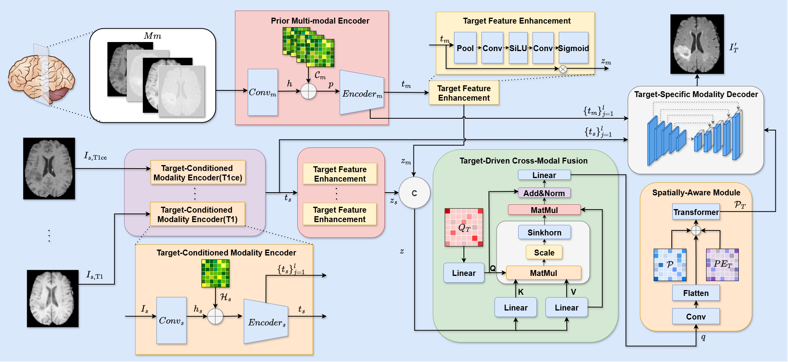

TC-MSNet: A Unified Target-Conditioned Modal Synthesis Network for Missing MRI Modalities
===
We propose a unified synthesis framework, TC-MSNet, which combines multiple target-conditioned single-modal encoders to extract relevant features and a multi-modal encoder to capture structural information, ensuring robustness across modality combinations. Additionally, a multi-dimensional fusion network is introduced to refine the target modality features through three key components: target feature enhancement, target-driven cross-modal fusion, and a spatially-aware module. 
# Overview

<p align="center"><em>Figure 1. Overview of TC-MSNet</em></p>

# How to run:
```bash
### Clone the repository
$ git clone https://github.com/SSongXujie/TC-MSNet.git
$ cd TC-MSNet
### Install & activate environment
$ conda env create -f environment.yml
### Set up the configuration of accelerate
$ accelerate config
```
We suggest the following folder structure for training:
```
data/
--- BraTS/
------ train/
------ valid/
------ test/
--- IXI/
------ train/
------ valid/
------ test/
```
We use the hdf5 format for training:
```
XXX.h5 = {image: 2D slices of C modalities (CxHxW)}
```
### Training:
For the BraTS dataset:
```
bash script/train/train_BraTS.sh
```
For the IXI dataset
```
bash script/train/train_IXI.sh
```
### Test:
For the BraTS dataset:
```
bash script/test/test_BraTS.sh
```
For the IXI dataset
```
bash script/test/test_IXI.sh
```
# Visualization result

<p align="center"><em>Figure 2. Visual examples of comparison results for the missing MR sequence on BraTS-2018.
The first column represents the input MR sequences: FLAIR, T1ce, T2, and T1 are located from the top-left in a clockwise direction. The target MR sequence is highlighted by a green border. The missing MR sequence is a gray mask image. The PSNR value is colored in yellow. </em></p>
